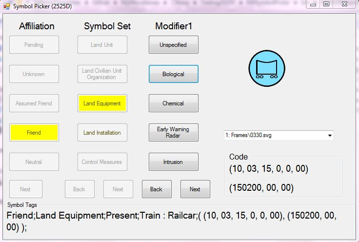

# Sample 2525D Library & Drawing Prototype

This is just a prototype project so I could learn 2525D and test/validate the data provided in the standard. It includes a test app to draw the symbols. 

*This repo/solution is not actively maintained and has been retired*

**An updated repo is now at https://github.com/csmoore/military-symbols-dotnet**

## Features

* A sample data model that corresponds to the 2525D symbol set
* A sample/prototype search capability
* A sample search and draw UI

## Requirements

* VS2012 (or later)
* Source SVG files (link to these files in the [instructions below](#building))

## Instructions

### Building

* Build the source solution .sln in Visual Studio
* IMPORTANT: This app depends on a set of SVG image files 
    * The drawing portion of this app will not be functional without these image files.
    * These file may be [obtained from here](https://github.com/Esri/joint-military-symbology-xml/tree/master/svg)
    * Unzip the files from the set above
* To make these svg files available to the application either
    * Copy them to the default application data folder at 
        * `MilSymbolPicker\bin\{Release | Debug}\Data\2525D_SVG_Images`
        * 2525D_SVG_Images subfolders should be {Appendices, Echelon, Frames, Headquarters, etc.}
    * You can also change the default location in the source 
        * Just update their location at: [./Library2525D/MilitarySymbolToGraphicLayersMaker.cs](./Library2525D/MilitarySymbolToGraphicLayersMaker.cs) and rebuild the project

### Running

* Run the application at `MilSymbolPicker\bin\{Release | Debug}\MilSymbolPicker.exe`
* Easter Egg: Mouse Click on the PictureBox Image to save the image shown as a .png file (usually used for reporting svg problems/anomalies).

## Licensing

Licensed under the Apache License, Version 2.0 (the "License");
you may not use this file except in compliance with the License.
You may obtain a copy of the License at

   http://www.apache.org/licenses/LICENSE-2.0

Unless required by applicable law or agreed to in writing, software
distributed under the License is distributed on an "AS IS" BASIS,
WITHOUT WARRANTIES OR CONDITIONS OF ANY KIND, either express or implied. See the License for the specific language governing permissions and
limitations under the License.

Note: This project also uses the C# SVG Rendering Engine (current Github forked repo below)

The C# SVG Rendering Engine is governed by the Microsoft Public License: https://svg.codeplex.com/license

For more information see the project pages at:

http://svg.codeplex.com/

https://github.com/vvvv/SVG 
